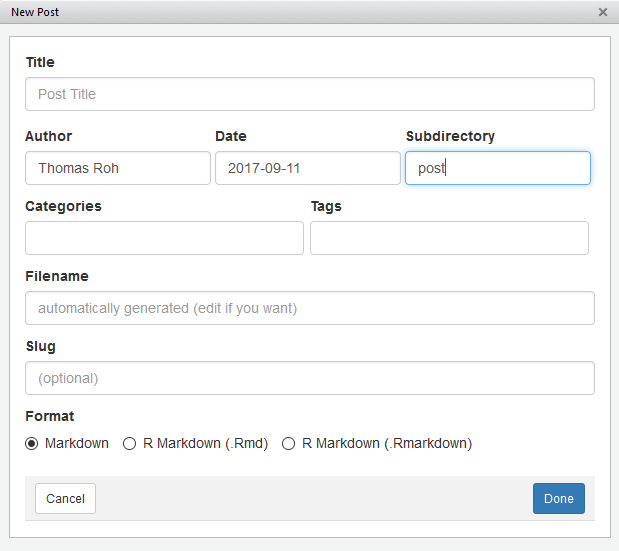

```{r setup, include=FALSE}
knitr::opts_chunk$set(echo = TRUE, eval = FALSE)
```


## Set up

You will first need to set up an account on [**github**](https://www.github.com) and 
install [**git**](https://git-scm.com/book/en/v2/Getting-Started-Installing-Git).

Next, make a copy of the repository into your desired workspace. I like to keep
all of my version controlled projects under one directory. Open up a command
terminal of your choosing and use the following:


```{bash}
cd #[working directory]
git clone https://github.com/omahar/omahar.git
git branch #[new branch]
git checkout #[new branch]
git push --set-upstream origin development
```


After the initial set up you can open the R Project in Rstudio and use the 
IDE to handle most of the work you will need to do in git.


***


The [`blogdown`](https://bookdown.org/yihui/blogdown/) package is an R interface 
to creating static web pages with Hugo. I will be using the 
[**Rstudio**](https://www.rstudio.com/) IDE and 
this package to do the majority of the heavy lifting.


```{r}
devtools::install_github('rstudio/blogdown')
```


## Creating a New Post

You can use the command line to create a new post:

```{r}
blogdown::new_post('Submitting a Post with Blogdown')
```


or you can use the Rstudio addin that is provided:





Blogdown supports both R Markdown or Markdown. You now have a templated
document set up to edit. Write your post and once you are satisfied that
you are ready to publish, re-build the site:

```{r}
blogdown::build_site()
```

Check for errors and visually inspect:

```{r}
blogdown::serve_site()
```


## Submitting a Post to the Website Repository


When you are ready to publish your post, you will need to head to the github 
repository for the website. To submit your post for publication, create a pull 
request to merge your branch with the master.


You will need to resolve any conflicts when merging the branches. Be wary of 
overwriting other files already in the master branch. Once the pull request is 
sent, it will need to pass a review before being published. When the changes 
are accepted and merged into the master, Netlify will rebuild the new part of 
the website and your post will be published to the website.


## Workflow

```{r, eval = TRUE, echo = FALSE}
library(DiagrammeR)
dotText <- "

digraph workflow {

  graph[compound = true, center = true, rankdir = LR]

  subgraph cluster0 {
  graph [label = 'Local Repository', fontsize = 50, labelloc = true]
  
  node [fontsize = 30]
  {rank = same; 'new_post'; 'git commit'; 'git push'; 'git pull'}
  

  'git pull' -> 'new_post' -> 'git commit' -> 'git push'
  'git push' -> 'git commit'
  
  }

  subgraph cluster1 {
  graph [label = 'Remote Repository', fontsize = 50, labelloc = true]

  node [fontsize = 30]
  {rank = same; 'pull request'; 'review'; 'merge'}
  
  'git push' -> 'pull request' -> 'review' -> 'git commit'
  'review' -> 'merge'
  }

  subgraph cluster2 {
  graph [label = 'Web', fontsize = 50, labelloc = true]

  node [fontsize = 30]
  {rank = same; 'merge', 'netlify'}

  'merge' -> 'netlify' -> 'publish'
  }
  
}
"
grViz(dotText)

```


